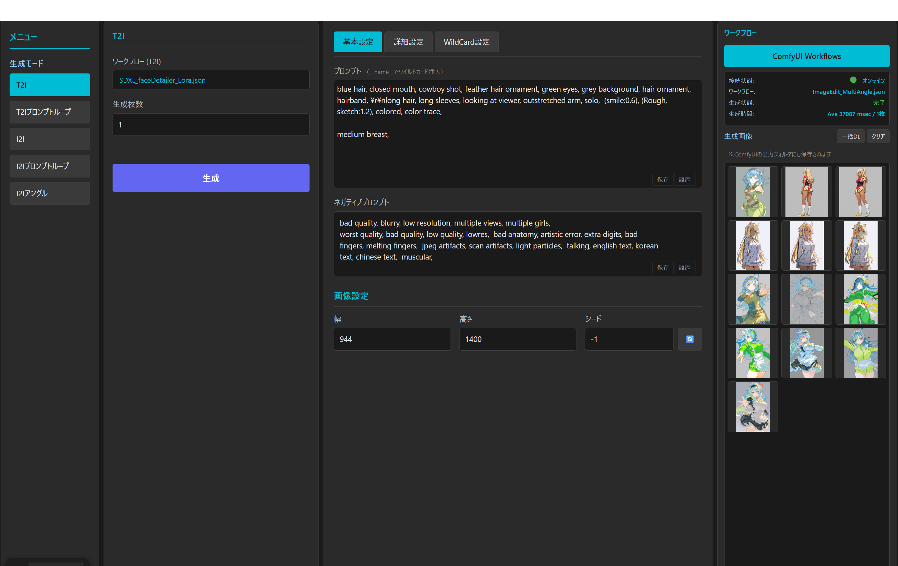

<p align="center">
  
</p>

<h1 align="center">ComfyUI SUI</h1>

<p align="center">
  <strong>Simple UI for ComfyUI - Web-based Image Generation Interface</strong>
</p>

<p align="center">
   Japanese &nbsp;|&nbsp;
   English &nbsp;|&nbsp;
   Chinese
</p>

---

## Features

| Feature | Description |
|:-------:|-------------|
| **T2I** | Text-to-Image generation |
| **I2I** | Image-to-Image generation |
| **Loop** | Batch generation with prompt lists |
| **Angle** | Multi-angle image generation |
| **Workflow** | Custom ComfyUI workflow management |
| **Wildcard** | Dynamic prompt variations with `__wildcard__` syntax |
| **Metadata** | Embed prompt info into generated images |
| **History** | Save and reuse prompt history |

---

## Quick Start

1. Start ComfyUI server
2. Open `index.html` in your browser
3. Enter your prompt and click **Generate**

---

## Requirements

- ComfyUI (running on `http://127.0.0.1:8188`)
- Modern web browser

---

## File Structure

```
ComfyUI_SUI/
├── index.html          # Main entry point
├── css/                # Stylesheets
├── js/
│   ├── core/           # Core modules
│   ├── ai/ComfyUI/     # ComfyUI integration
│   ├── generator/      # Image generation
│   ├── prompt/         # Prompt utilities
│   ├── wildcard/       # Wildcard management
│   ├── i18n/           # Internationalization
│   └── ui/             # UI components
└── image/              # Assets
```

---

## License

MIT License
